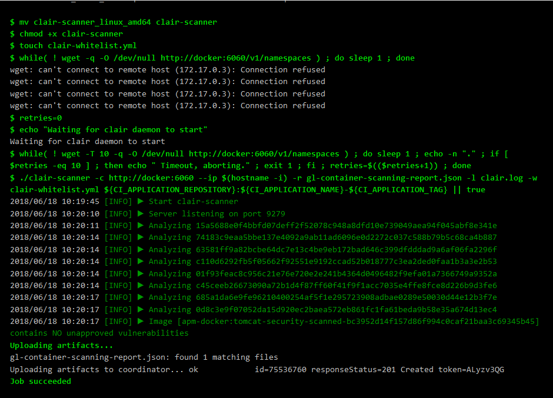

# Description

This sample project demonstrates how to use Clair and AquaSec to scan your docker containers before deployment. It uses the GitLab CI/CD pipeline to build, scan, and deploy a minimal tomcat docker container. Note that the tomcat container is only for testing purposes. No production ready container!

Clair and clair-scanner are tools to check Docker images for known vulnerabilities. Both are open source and aim for static analysis of containers. For more information on both see: [Clair](https://github.com/coreos/clair) and [Clair-Scanner](https://github.com/arminc/clair-scanner).

AquaSec microscanner is a similar software to scan docker images during creation. More information can be found here: [AquaSec Microscanner](https://github.com/aquasecurity/microscanner). Rather than scanning the image after it has been build (as done by Clair), the microscanner needs to be defined within your Dockerfile and is executed during docker image build. Clearly, the new created docker image should not be deployed but is only used for scanning purposes and can be dropped afterwards. 

# Gitlab-CI 

The goal of this sample project is to enable security scanning before pushing a docker image to a container registry. This example is based on the official Gitlab tutorial [Gitlab Clair](https://docs.gitlab.com/ee/ci/examples/container_scanning.html)

The first job is to build a docker image. 

```
## Build a docker container and pass it to the next stage
build:
  stage: build
  script:
    - docker build -t ${CI_APPLICATION_REPOSITORY}:${CI_APPLICATION_NAME}-${CI_APPLICATION_TAG} . 
    - mkdir image_cache
    - docker save ${CI_APPLICATION_REPOSITORY}:${CI_APPLICATION_NAME}-${CI_APPLICATION_TAG} > image_cache/cached_image.tar    
  artifacts:
    paths:
      - image_cache
```

In order to use caching and pass the created docker image to the next job, we create a new directory named "image_cache" and sage the created image. Note that this step is required, since we do not have access to /var/lib/docker. The resulting image is stored in image_cache/cached_image.tar

## Clair Scanning

Next, we start the container scanning job. The first task to be done is to load the docker image that has been cached from the build job. Afterwards, we start the clair-scanner. 

```
# Perform security scan with clair
container_scanning:
  stage: test
  script:
    - docker load -i image_cache/cached_image.tar
    - docker run -d --name db arminc/clair-db:latest
    - docker run -p 6060:6060 --link db:postgres -d --name clair --restart on-failure arminc/clair-local-scan:v2.0.1
    - wget https://github.com/arminc/clair-scanner/releases/download/v8/clair-scanner_linux_amd64
    - mv clair-scanner_linux_amd64 clair-scanner
    - chmod +x clair-scanner
    - touch clair-whitelist.yml
    - while( ! wget -q -O /dev/null http://docker:6060/v1/namespaces ) ; do sleep 1 ; done
    - retries=0
    - echo "Waiting for clair daemon to start"
    - while( ! wget -T 10 -q -O /dev/null http://docker:6060/v1/namespaces ) ; do sleep 1 ; echo -n "." ; if [ $retries -eq 10 ] ; then echo " Timeout, aborting." ; exit 1 ; fi ; retries=$(($retries+1)) ; done
    - ./clair-scanner -c http://docker:6060 --ip $(hostname -i) -r gl-container-scanning-report.json -l clair.log -w clair-whitelist.yml ${CI_APPLICATION_REPOSITORY}:${CI_APPLICATION_NAME}-${CI_APPLICATION_TAG} || true
  artifacts:
    paths: [gl-container-scanning-report.json]
```

The final result of the scan is presented in the job. 


Note that it is possible to integrate the results in Gitlab merge requests. For more information on how to use this tool see: 
[Clair-Scanner Gitlab](https://docs.gitlab.com/ee/user/project/merge_requests/container_scanning.html)

## AquaSec Scanning
To run the AquaSec Microscanner on an already build docker image, we have to create a new docker image with a new layer containing the microscanner. Rather than doing this manually, we reuse the microscanner wrapper that provides such functionality. It can be found here [Microscanner-Wrapper](https://github.com/lukebond/microscanner-wrapper). Hence, in our job we simply need to download the wrapper and execute it as follows: 

```
# Perform a security scan with aquasec microscanner
aqua_scan:
  stage: test
  script:
    - docker load -i image_cache/cached_image.tar
    - apk add git bash --no-cache 
    - git clone https://github.com/lukebond/microscanner-wrapper.git aquasec
    - chmod +x aquasec/scan.sh
    - bash scan.sh
```

Note that before using the microscanner, you have to acquire a token. Ensure that this token is not used in plain text in your build scripts. Better use GitLab secret variables. 

The scanning result will contain a list of vulnerabilities, a scanning summary, and some descriptions. Moreover, it also contains your aquasec scanner token, which is unfortunately not a good practice. Hence, the scanner call is encapsulated in the scan.sh script to only show the scanning result:

```
#!/bin/bash

MICROSCANNER_TOKEN=${AQUA_SEC_TOKEN} bash aquasec/scan.sh ${CI_DOCKER_IMAGE_NAME} > result.txt

sed -n '/vulnerability_summary/,/^}/ { x; /^$/! p; }' result.txt
```

The result of the scan is shown below:

